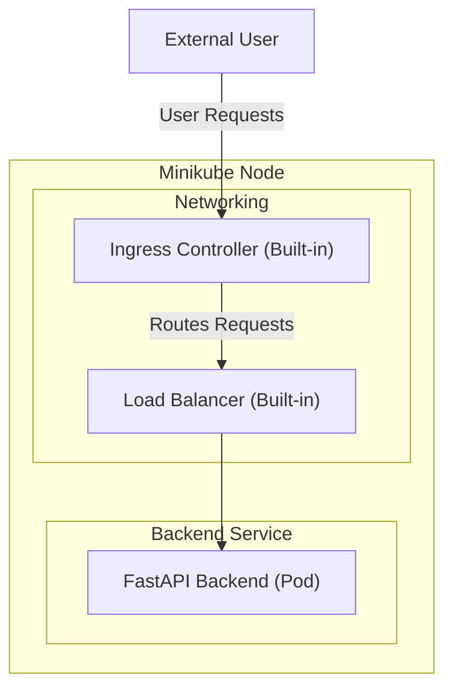

## Overview
This document presents my learnings from building a Kubernetes-based cloud-native application using **Docker, FastAPI, and Minikube**. The goal was to understand Kubernetes concepts such as **Pods, Services, Ingress, and Nodes**, while deploying a basic FastAPI backend in a local Kubernetes cluster.

---

## What is Docker?
Docker is a containerization platform that allows packaging an application and its dependencies into a **lightweight container**.

###  Key Docker Commands:
```sh
docker build -t my-kube-app .

docker images

docker run -p 8000:8000 my-kube-app
```

I was getting an issue of my docker image is present in the repos of docker images but it is not in the minikube repo.
The issue was that I was building the docker images in the built-in Docker Daemon and not in the local Docker. So to fix this I used the below command
```sh
eval $(minikube docker-env)

```

---

##  What is Kubernetes?
Kubernetes is a container orchestration system that helps manage containerized applications efficiently.

###  Key Kubernetes Concepts:
- **Node:** A machine (virtual/physical) where Kubernetes runs workloads (Minikube in this case).
- **Pod:** The smallest deployable unit containing one or more containers (FastAPI in this case).
- **Service:** A stable networking endpoint that routes traffic to Pods.
- **Ingress:** Manages external access to Services inside a cluster.

---

##  Deployment Architecture
We used **Minikube** as our Kubernetes node, which already includes essential components like **Service and Ingress**.



---

##  Deploying to Kubernetes

###  Start Minikube:
```sh
minikube start
```

###  Load Docker Image into Minikube:
```sh
minikube image load my-kube-app
```

###  Deploy to Kubernetes:
```sh
kubectl apply -f deployment.yaml
kubectl apply -f service.yaml
```

### Check the deployment:
```sh
kubectl get pods
minikube service my-kube-app --url
```


###  Debugging Issues:
```sh
kubectl logs <pod-name>
kubectl describe pod <pod-name>
```


---

