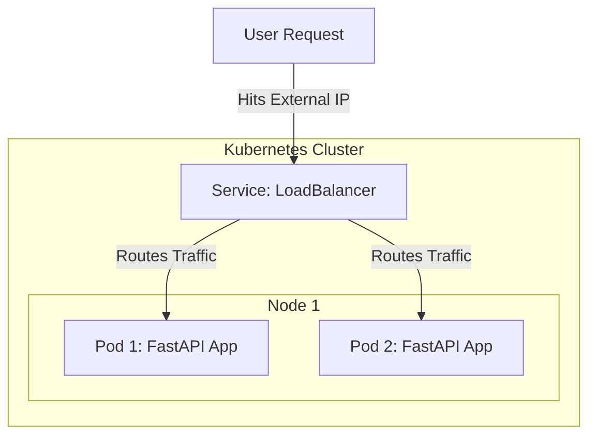

```mermaid
graph TD
    subgraph Cluster [Kubernetes Cluster]
        subgraph Node1 [Node 1]
            Pod1[Pod 1: FastAPI App]
            Pod2[Pod 2: FastAPI App]
        end
        
        Service[Service: LoadBalancer] -->|Routes Traffic| Pod1
        Service -->|Routes Traffic| Pod2
    end

    User[User Request] -->|Hits External IP| Service
```
